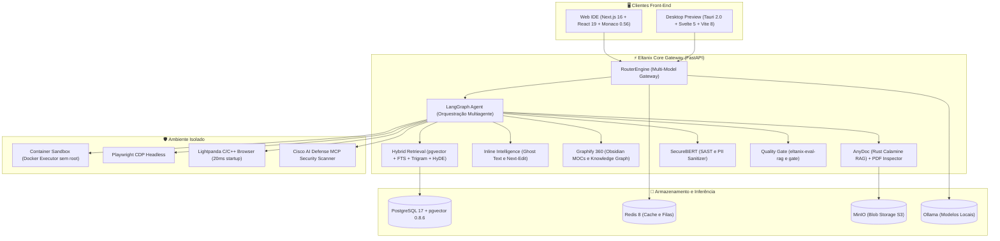
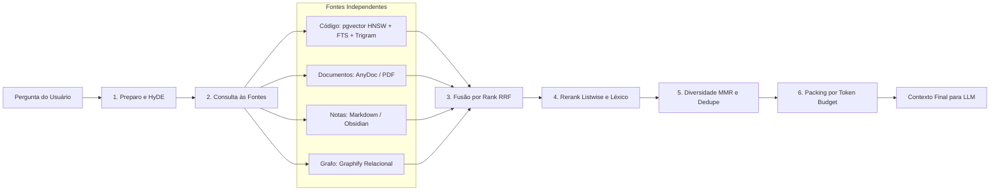

# Eltanix Coder IDE

<p align="center">
  <a href="https://github.com/LeonardoFSR75/Eltanix-Coder-IDE/actions/workflows/ci.yml"></a>
  <a href="LICENSE"></a>
  <a href="https://www.python.org/"></a>
  <a href="https://nextjs.org/"></a>
  <a href="https://react.dev/"></a>
  <a href="https://www.typescriptlang.org/"></a>
  <a href="https://svelte.dev/"></a>
  <a href="https://github.com/pgvector/pgvector"></a>
  <a href="https://github.com/LeonardoFSR75/Eltanix-Coder-IDE/discussions"></a>
  <a href="CONTRIBUTING.md"></a>
</p>

**Plataforma local-first de codificação agêntica.** Um IDE web completo estilo VS Code — editor
Monaco, autocompletar inline (*ghost text*), predição de próximo edit (*tab to jump*), terminal
integrado, navegador híbrido interno, gestão de dependências e chat com um agente autônomo baseado em
LangGraph que lê, edita e executa comandos sobre o seu próprio repositório, sempre com aprovação humana
nas ações de risco.

Toda a stack roda em contêineres Docker na sua máquina (ou servidor dedicado): PostgreSQL 17 com
extensão `pgvector`, Redis 8, MinIO (armazenamento S3 local), Ollama e um sandbox de execução isolado.
Nenhum código nem segredo sai do seu ambiente além das chamadas que você mesmo autorizar a um provedor
de LLM configurado.

O princípio fundacional da plataforma: **nenhum módulo fala com um provedor de LLM diretamente.** Toda
chamada passa por um único router (`RouterEngine`), e cada provedor entra como adaptador plugável — trocar
de modelo, ajustar prefixos de embedding assimétricos ou migrar de nuvem é mudança de configuração, não
de código ([ADR 0001](docs/adr/0001-camada-unica-de-llm.md)).



---

## Índice

- [Recursos & módulos principais](#-recursos--módulos-principais)
- [Início rápido](#-início-rápido)
- [Estrutura do repositório](#-estrutura-do-repositório)
- [Inteligência no editor (Ghost Text, Next-Edit & Cmd+K)](#-inteligência-no-editor-ghost-text-next-edit--cmdk)
- [Camada de recuperação híbrida & RAG avançado](#-camada-de-recuperação-híbrida--rag-avançado)
- [Régua de qualidade e evals automatizados](#-régua-de-qualidade-e-evals-automatizados)
- [Navegador interno & verificação visual](#-navegador-interno--verificação-visual)
- [RAG multi-formato & documentos](#-rag-multi-formato--documentos)
- [Scraping & Deep Research com Firecrawl](#️-scraping--deep-research-com-firecrawl)
- [Governança de dependências & pacotes](#-governança-de-dependências--pacotes)
- [Segurança & sandboxing](#-segurança--sandboxing)
- [Testes & qualidade de código](#-testes--qualidade-de-código)
- [Documentação de arquitetura & ADRs](#-documentação-de-arquitetura--adrs)
- [Contribuindo](#-contribuindo)
- [Licença](#-licença)

---

## 🌟 Recursos & Módulos Principais

| Módulo | Escopo & Capacidades | Maturidade |
|---|---|---|
| **Inteligência Inline no Editor (Onda 1)** | Autocompletar inline com *ghost text* de baixa latência (`Tab`), predição do próximo edit (*tab to jump*), edição inline `Cmd+K` com accept/reject por hunk, gutter com blame/testes/CVEs e busca semântica no painel Search | 🟢 Stable |
| **Camada de Recuperação Híbrida (`retrieval/`)** | Pipeline desacoplado de 6 estágios (*preparo → fontes → fusão por rank → rerank listwise/léxico → MMR diversidade → packing por orçamento*) combinando pgvector HNSW, full-text code-aware e trigramas `pg_trgm` | 🟢 Stable |
| **Régua de Evals & Quality Gate** | Suíte de avaliação contínua (`eltanix-eval-rag`, `eltanix-eval-gate`, `eltanix-eval-judge`) com métricas *recall@k*, *MRR*, *nDCG* e calibração de juiz LLM com intervalo de confiança bootstrap | 🟢 Stable |
| **Navegador Interno Híbrido** | Modo **Tela Cheia (`F11`)**, múltiplas abas dinâmicas, histórico completo, emuladores de dispositivos (Desktop, Tablet, Mobile), favoritos rápidos, modo **Live Iframe** (com HMR) e **Headless CDP** compatível com **Playwright** e **Lightpanda** | 🟢 Stable |
| **RAG Multi-Formato Universal** | Extração ultrarrápida em Rust via **AnyDoc** (motor **Calamine**) para Word (`.docx`, `.odt`), Excel (`.xlsx`, `.xls`, `.xlsb`, `.ods`, `.csv`), PowerPoint (`.pptx`, `.odp`), EPUB, RTF e classificação inteligente de PDFs via **PDF Inspector** | 🟢 Stable |
| **Web Scraping & Deep Research (Firecrawl)** | Web scrape limpo em Markdown, crawling recursivo de documentações, clonagem de UI React (`clone_web_ui`), pesquisa profunda com citações (`deep_research`) e **proteção anti-SSRF** | 🟢 Stable |
| **Gateway Multi-Modelo & Router** | Roteamento unificado (Ollama, Azure, Databricks, Anthropic, Groq, OpenAI), fallback automático, circuit breaker, prefixos assimétricos de embedding e contabilidade de tokens/custos | 🟢 Stable |
| **Agente LangGraph & Orquestração** | Loop autônomo (*think → approve → act*), sandbox isolado de execução, ferramentas por classe de risco (`RiskClass`), modos `ask`, `edit`, `agent`, `plan`, `auto` e `orchestra`, orquestração multiagente (`spawn_agent`) | 🟢 Stable |
| **Sandbox & Executor Isolado** | Isolamento de comandos em container dedicado com privilégios reduzidos (`cap_drop: ALL`, usuário não-root, rede restrita e comunicação autenticada via `EXECUTOR_TOKEN`) | 🟢 Stable |
| **IDE Web Agêntica (Next.js 16 + React 19)** | Editor Monaco 0.56 (split-pane), terminal xterm.js 6, explorador de arquivos, cards de ferramentas estruturados, Agent Dock, painel RAG, Segundo Cérebro e central de configurações | 🟢 Stable |
| **Segundo Cérebro & Obsidian (Graphify)** | Base de conhecimento e grafo 360° com 20 fases mapeadas, MOCs, Obsidian Canvas interativo, busca relacional $N$-hops (`graph_search`) e Graph View 2D/3D | 🟢 Stable |
| **Governança de Pacotes (`manage_packages`)** | Gestão padronizada de dependências Python (`uv`) e Node/TypeScript (`bun`) com imposição de stack e bloqueio contra desvios arquiteturais | 🟢 Stable |
| **Extensões (Open VSX)** | 6 Suítes Nativas de extensões com persistência no PostgreSQL e auto-update com degradação graciosa | 🟡 Beta |
| **MCP (Model Context Protocol)** | Suporte completo a servidores MCP (stdio/HTTP) com scanner de segurança integrado (Cisco AI Defense MCP Scanner) | 🟡 Beta |
| **App Desktop (Tauri 2.0 + Svelte 5)** | Shell desktop nativo com Svelte 5, Vite 8 e Tauri 2.0 *(Preview disponível em `:5409`; desenvolvimento congelado durante a Onda 1 da IDE Web)* | 🔴 Experimental |

---

## 🚀 Início Rápido

Toda a plataforma sobe em contêineres Docker isolados — basta um único comando `docker compose up`.

### 1. Configurar variáveis de ambiente

Copie o arquivo de exemplo e configure suas chaves:

```bash
cp .env.example .env
```

Gere chaves criptográficas seguras:

```bash
python -c "import secrets;print(secrets.token_urlsafe(32))"
```

Configure no `.env`:
- `ELTANIX_API_KEY`: chave mestre para integrações externas (Cline, Continue, Aider, extensões).
- `EXECUTOR_TOKEN`: token compartilhado para comunicação segura com o sandbox do executor.
- `ELTANIX_ADMIN_USERNAME` e `ELTANIX_ADMIN_PASSWORD`: credenciais de acesso à interface web.
- `TOTP_ENCRYPTION_KEY`: chave para cifra em repouso dos segredos 2FA (TOTP) via `cryptography`.
- `FIRECRAWL_API_KEY`: (opcional) chave da API Firecrawl para scraping e deep research na web pública.

### 2. Subir a stack via Docker Compose

```bash
docker compose up -d --build
```

Execute as migrações do banco de dados:

```bash
docker compose exec api alembic upgrade head
```

### 3. Acessar os serviços

| Serviço | Porta local | URL de acesso | Descrição |
|---|---|---|---|
| **IDE & Dashboard (Next.js Web)** | `5400` | [http://localhost:5400](http://localhost:5400) | Interface principal do IDE e gestão agêntica |
| **Navegador Interno Dedicado** | `5400` | [http://localhost:5400/browser](http://localhost:5400/browser) | Navegador com emuladores de dispositivos |
| **API & Gateway (FastAPI)** | `5401` | [http://localhost:5401/docs](http://localhost:5401/docs) | Documentação OpenAPI interativa (Swagger) |
| **PostgreSQL + pgvector** | `5403` | `127.0.0.1:5403` | Banco de dados principal e vetores de embeddings |
| **Redis 8** | `5404` | `127.0.0.1:5404` | Cache, filas, rate limiting e circuit breaker |
| **Ollama Local** | `5405` | [http://localhost:5405](http://localhost:5405) | Servidor de inferência local para LLMs e embeddings |
| **MinIO API (Storage S3)** | `5407` | `127.0.0.1:5407` | Endpoint S3 para upload e download de artefatos |
| **MinIO Console** | `5408` | [http://localhost:5408](http://localhost:5408) | Painel web de administração do storage |
| **Desktop IDE Preview (Svelte 5)** | `5409` | [http://localhost:5409](http://localhost:5409) | Preview web do shell desktop Svelte 5 / Vite 8 |
| **Cisco MCP Security Scanner** | `5410` | [http://localhost:5410](http://localhost:5410) | Serviço de análise e varredura de servidores MCP |

---

## 📂 Estrutura do Repositório

| Diretório | O quê |
|---|---|
| `apps/api` | Backend FastAPI + SQLAlchemy async + LangGraph — router LLM, agente, camada `retrieval/`, RAG, Graphify, MCP e evals |
| `apps/web` | IDE web moderna em Next.js 16 + React 19 — Monaco 0.56, xterm 6, Agent Dock, navegador interno e Segundo Cérebro |
| `apps/desktop` | Shell desktop em Svelte 5 + Vite 8 + Tauri 2.0 (preview web em `:5409`, congelado conforme [ADR 0013](docs/adr/0013-apps-desktop-congelado.md)) |
| `services/browser` | Serviço de navegador headless (Playwright CDP / Lightpanda) com screencast e inspeção DOM |
| `services/executor` | Sandbox isolado de execução de comandos em container Docker sem root ([ADR 0002](docs/adr/0002-executor-isolado.md)) |
| `services/mcp-scanner` | Serviço de segurança e varredura de servidores MCP (Cisco AI Defense MCP Scanner) |
| `config` | Arquivos declarativos de configuração (`providers.yaml`, `routes.yaml`, `mcp.yaml`, `eval_dataset.yaml`, etc.) |
| `docs/adr` | Registros de Decisões Arquiteturais (ADRs 0001 a 0019) |
| `docs` | Documentação técnica aprofundada, capacidades do IDE, dossiê e propostas |
| `graphify-out/obsidian` | Base de conhecimento e grafo 360° sincronizados com o Obsidian Vault |

Cada aplicação conta com seu respectivo guia de engenharia: [`apps/api/CLAUDE.md`](apps/api/CLAUDE.md),
[`apps/web/CLAUDE.md`](apps/web/CLAUDE.md) e [`apps/desktop/CLAUDE.md`](apps/desktop/CLAUDE.md).

---

## ✍️ Inteligência no Editor (Ghost Text, Next-Edit & Cmd+K)

A IDE conta com uma camada nativa de assistência inteligente integrada diretamente ao editor Monaco (entregue na **Onda 1**):

- **Autocompletar Inline (*Ghost Text*)**: Após breve pausa na digitação (~250ms), sugestões cinzas de 1 a 8 linhas são renderizadas inline e aceitas instantaneamente com `Tab` ([ADR 0014](docs/adr/0014-autocompletar-inline-ghost-text.md)). Rota READ-only `POST /api/context/completions` consumindo modelos rápidos configurados no perfil `completion`.
- **Predição do Próximo Edit (*"Tab to Jump"*)**: Ao concluir uma edição, o modelo antecipa qual o próximo bloco de código a ser modificado no arquivo e posiciona o cursor lá com um `Tab` adicional ([ADR 0015](docs/adr/0015-predicao-do-proximo-edit.md)).
- **Edição Inline sob Demanda (`Cmd+K` / `Ctrl+K`)**: Seleção de trecho de código acompanhada de instrução em linguagem natural, com streaming em tempo real e interface de aceitação/rejeição por hunk (*diff inline*).
- **Gutter Intelligence**: Anotações na margem do editor exibindo *git blame*, cobertura de testes unitários e alertas de vulnerabilidades (CVEs) em tempo real.
- **Busca Semântica no Painel de Busca**: Busca contextual no repositório inteiro através de similaridade vetorial (`pgvector`).

---

## 🧠 Camada de Recuperação Híbrida & RAG Avançado

A camada `retrieval/` ([ADR 0019](docs/adr/0019-camada-de-recuperacao.md)) orquestra as quatro fontes de informação do sistema (*código do projeto, documentos carregados, notas do Segundo Cérebro e grafo Graphify*) através de um pipeline desacoplado e determinístico:



- **Três Sinais por Fonte de Código**: Vetores densos (HNSW `pgvector`), busca textual *code-aware* (com suporte a `camelCase` e `snake_case` indexados via função SQL dedicada) e trigramas `pg_trgm` para tolerância a erros e buscas parciais.
- **Contrato Estrito do Espaço Vetorial ([ADR 0017](docs/adr/0017-contrato-do-espaco-vetorial.md))**: Cada vetor registra seu `embedding_model` resolvido, garantindo que buscas vetoriais só comparem embeddings do mesmo modelo e dimensão.
- **Rerank de Segunda Passagem**: Avaliação léxica refinada somada a rerank listwise por LLM através do perfil utilitário `utility`.

---

## 📊 Régua de Qualidade e Evals Automatizados

Para garantir que melhorias no chunker, no RRF ou nos modelos de embedding não causem regressões, o sistema conta com uma suíte de avaliação contínua ([ADR 0018](docs/adr/0018-gate-de-qualidade-de-recuperacao.md)):

```bash
# Executar a suíte de avaliação de recuperação RAG
docker compose exec api eltanix-eval-rag

# Validar se a qualidade atende a régua baseline do repositório
docker compose exec api eltanix-eval-gate

# Calibrar o juiz LLM com intervalo de confiança estatístico
docker compose exec api eltanix-eval-judge
```

- **Métricas Computadas**: *Recall@k*, *MRR* (Mean Reciprocal Rank) e *nDCG* contra o dataset canônico em `config/eval_dataset.yaml`.
- **Bloqueio em CI**: Regressões além da margem de tolerância em relação a `config/eval_baseline.json` causam falha no gate de qualidade.

---

## 🌐 Navegador Interno & Verificação Visual

O Eltanix Coder IDE conta com um navegador de desenvolvimento integrado completo:
- **Modo Tela Cheia (`F11`)**: Expande a visualização para 100% da tela do monitor para testes visuais imersivos e responsivos.
- **Múltiplas abas**: Abra e gerencie múltiplas sessões com URLs e históricos independentes.
- **Emulador de dispositivos**: Teste em tempo real layouts em **Desktop (1280px)**, **Tablet (768x1024)** e **Mobile (375x667 / 390x844)** com rotação e controle de zoom.
- **Modo Live (⚡ Live)**: Iframe em sandbox com Hot Module Replacement (HMR) e WebSockets em tempo real.
- **Modo Headless (🤖 Agente)**: Conexão CDP com motores headless (Playwright / Lightpanda) para screenshots, inspeção do DOM e telemetria de rede.

---

## 📚 RAG Multi-Formato & Documentos

Faça upload direto de qualquer formato corporativo no painel `/rag`:
- 📕 **PDFs**: Classificação inteligente via `pdf-inspector` (Rust) com detecção de scans sem OCR e fallback gracioso para `pypdf`.
- 📘 **Word**: `.docx`, `.doc`, `.docm`, `.odt`.
- 📊 **Excel & Planilhas**: `.xlsx`, `.xls`, `.xlsb`, `.ods`, `.csv`, `.tsv` (processados pelo motor Rust `calamine`).
- 📙 **PowerPoint**: `.pptx`, `.ppt`, `.ppsx`, `.odp`.
- 📗 **E-books & Rich Text**: `.epub`, `.rtf`, `.md`, `.txt`.

---

## 🕷️ Scraping & Deep Research com Firecrawl

O agente possui ferramentas especializadas para interação com a web pública:
- `web_scrape`: Extração de Markdown limpo e sem anúncios.
- `web_search`: Pesquisa rápida na web com sumarização.
- `crawl_and_index_docs`: Indexação recursiva de árvores completas de documentação técnica.
- `clone_web_ui`: Blueprint estruturado para recriação de interfaces em React.
- `deep_research`: Pesquisa autônoma multi-etapa com decomposição de consultas e relatório citado (`[[1]]`, `[[2]]`).
- **Guardião anti-SSRF**: Validador rigoroso bloqueando loopback, redes privadas (RFC 1918), metadados de nuvem e hosts de contêineres internos.

---

## 📦 Governança de Dependências & Pacotes

A ferramenta `manage_packages` gerencia as dependências do projeto impondo regras arquiteturais estritas:
- **Backend (Python)**: Gerenciado exclusivamente via `uv` com suporte a `install`, `uninstall`, `sync`, `list` e `audit`. Frameworks concorrentes incompatíveis (ex: Flask, Django) são bloqueados pela governança da stack.
- **Frontend (Node/TypeScript)**: Gerenciado via `bun` com manipulação e auditoria de `package.json`.

---

## 🔒 Segurança & Sandboxing

- **Login obrigatório**: Toda rota HTTP exige sessão válida (cookie httpOnly) ou `ELTANIX_API_KEY` — nenhuma fica aberta por omissão ([ADR 0005](docs/adr/0005-login-obrigatorio.md)).
- **Autenticação 2FA (TOTP)**: Suporte a segundo fator TOTP com segredo cifrado em repouso via `cryptography`.
- **Execução isolada**: Comandos do agente nunca falam direto com o daemon Docker da API — passam pelo serviço `executor` separado, sem rede e sem root ([ADR 0002](docs/adr/0002-executor-isolado.md)).
- **Aprovação por classe de risco**: Toda ferramenta declara `READ`/`WRITE`/`EXEC`; ações `WRITE`/`EXEC` sempre pausam para aprovação humana antes de executar.
- **Anti-SSRF**: Toda requisição web externa (Firecrawl, navegador, deep research) é validada contra RFC 1918, loopback, metadados de nuvem e hostnames de contêiner.
- **Sanitização de PII**: CPF, e-mail, cartão e chaves de API são mascarados dinamicamente em prompts antes de saírem para modelos remotos ([ADR 0011](docs/adr/0011-sanitizacao-dinamica-pii.md)).
- **Auditoria de segredos**: [`.gitleaks.toml`](.gitleaks.toml) audita o repositório continuamente contra vazamento de credenciais.
- **Scanner MCP**: Servidores MCP externos passam por varredura de segurança (Cisco AI Defense MCP Scanner) antes de disponibilizar ferramentas ao agente ([ADR 0010](docs/adr/0010-seguranca-mcp-e-cisco-scanner.md)).

---

## 🧪 Testes & Qualidade de Código

Executar a suíte completa de testes e verificações de qualidade:

```bash
# Testes do backend (FastAPI + RAG + Retrieval + Agent)
docker compose exec api uv run pytest tests -q

# Verificação de lint e formatação do backend
docker compose exec api uv run ruff check src
docker compose exec api uv run ruff format --check src

# Typecheck estático do backend
docker compose exec api uv run mypy src

# Typecheck, testes unitários e build do frontend (Next.js 16)
cd apps/web && bun run typecheck && bun run test && bun run build

# Execução dos Evals de Qualidade RAG
docker compose exec api eltanix-eval-rag
docker compose exec api eltanix-eval-gate
```

---

## 📖 Documentação de Arquitetura & ADRs

Consulte a documentação técnica e os Registros de Decisões Arquiteturais:

- [Visão Geral de Arquitetura](docs/architecture.md)
- [Capacidades e Estratificação da IDE Agêntica](docs/ide_capabilities.md)
- [Dossiê Técnico Completo](docs/dossie_tecnico.md)
- [ADR 0001 — Camada Única de LLM](docs/adr/0001-camada-unica-de-llm.md)
- [ADR 0002 — Executor Isolado](docs/adr/0002-executor-isolado.md)
- [ADR 0003 — Grafo de Conhecimento e Graph RAG (Graphify)](docs/adr/0003-grafo-de-conhecimento-graphify.md)
- [ADR 0004 — Orquestração Multiagente](docs/adr/0004-orquestracao-multiagente.md)
- [ADR 0005 — Login Obrigatório com Sessão por Cookie](docs/adr/0005-login-obrigatorio.md)
- [ADR 0006 — Integração Firecrawl para Web Scraping, Search e Ingestão de Docs no RAG](docs/adr/0006-integracao-firecrawl-web-rag.md)
- [ADR 0007 — Navegador Interno Híbrido, Emulação de Dispositivos e Compatibilidade Lightpanda](docs/adr/0007-navegador-interno-e-emulacao-visual.md)
- [ADR 0008 — RAG Multi-Formato Universal com AnyDoc, Motor Calamine e PDF Inspector](docs/adr/0008-rag-multi-formato-anydoc-e-pdf-inspector.md)
- [ADR 0009 — Sistema de 6 Suítes de Extensões e Auto-Update Open VSX](docs/adr/0009-sistema-de-extensoes-e-auto-update-open-vsx.md)
- [ADR 0010 — Segurança de Servidores MCP e Cisco AI Defense Scanner](docs/adr/0010-seguranca-mcp-e-cisco-scanner.md)
- [ADR 0011 — Sanitização Dinâmica de Prompts e Mascaramento de PII](docs/adr/0011-sanitizacao-dinamica-pii.md)
- [ADR 0012 — Modos Customizáveis do Agente e o Gate de Ferramentas por Nome](docs/adr/0012-modos-customizaveis-e-gate-de-ferramentas.md)
- [ADR 0013 — `apps/desktop` Congelado até a IDE Web Cruzar a Onda 1](docs/adr/0013-apps-desktop-congelado.md)
- [ADR 0014 — Autocompletar Inline (*Ghost Text*) no Editor](docs/adr/0014-autocompletar-inline-ghost-text.md)
- [ADR 0015 — Predição do Próximo Edit ("Tab to Jump")](docs/adr/0015-predicao-do-proximo-edit.md)
- [ADR 0016 — `ProjectRecord.local_path` é a Fonte de Verdade da Localização do Projeto](docs/adr/0016-local-path-fonte-de-verdade.md)
- [ADR 0017 — Contrato do Espaço Vetorial](docs/adr/0017-contrato-do-espaco-vetorial.md)
- [ADR 0018 — Gate de Qualidade de Recuperação](docs/adr/0018-gate-de-qualidade-de-recuperacao.md)
- [ADR 0019 — Camada de Recuperação (`retrieval/`)](docs/adr/0019-camada-de-recuperacao.md)

---

## 🤝 Contribuindo

Este projeto está em desenvolvimento ativo e aceita contribuições. Veja
[`CONTRIBUTING.md`](CONTRIBUTING.md) para o fluxo de PR, convenções de código e execução de testes.
Participantes concordam em seguir o [`CODE_OF_CONDUCT.md`](CODE_OF_CONDUCT.md).
Vulnerabilidades de segurança possuem um fluxo dedicado — consulte [`SECURITY.md`](SECURITY.md), não
abra uma issue pública.

---

## 📄 Licença

Licenciado sob [Apache License 2.0](LICENSE).
